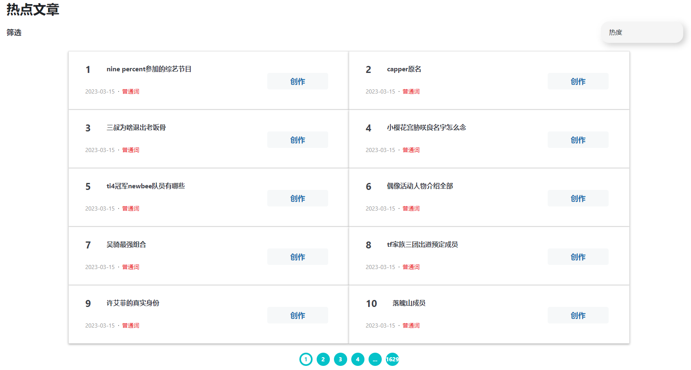
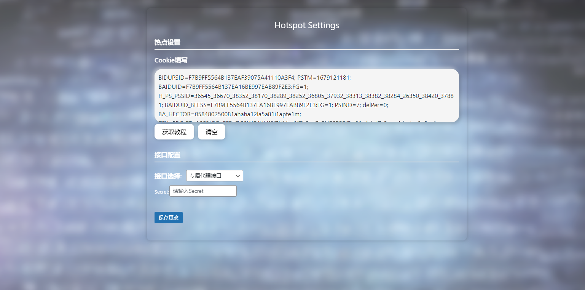
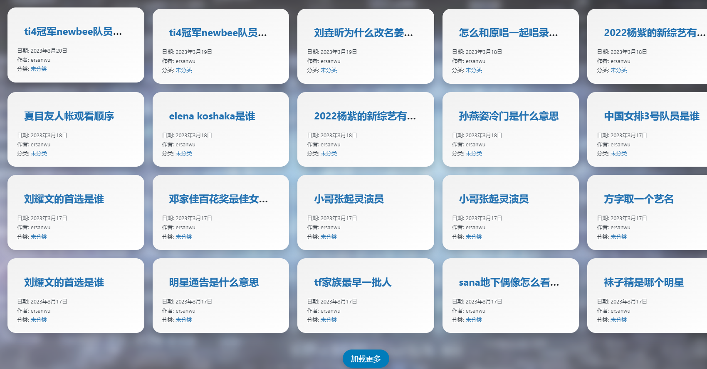
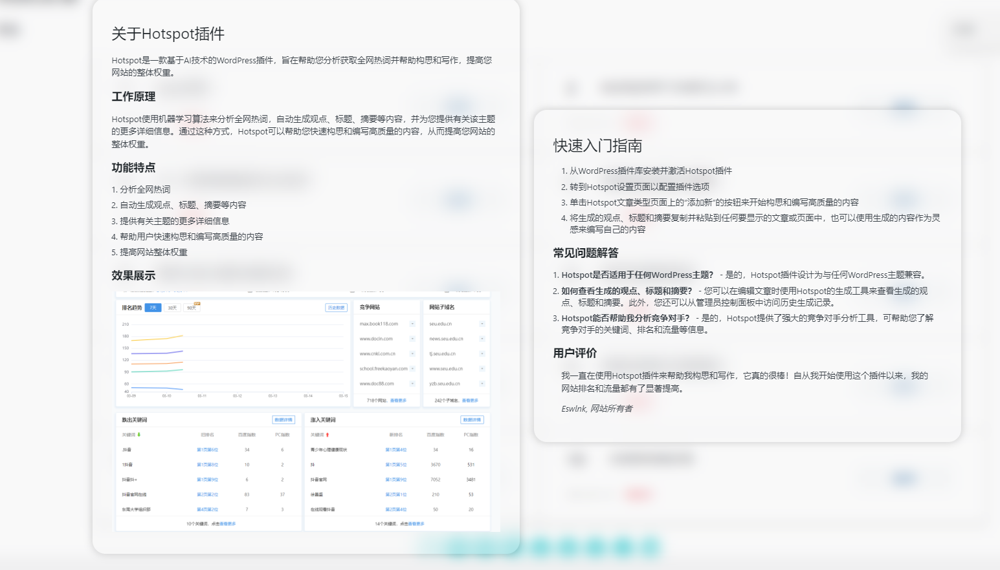
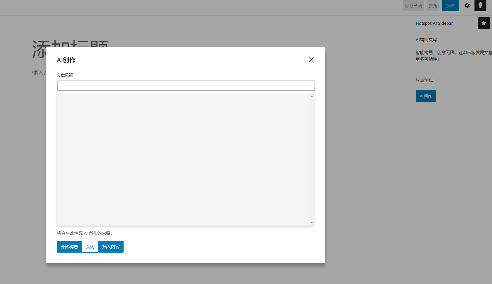

=== 插件名称 ===

Contributors: ersanwu

Tags: hotspot,writer

Requires at least: 5.8

Tested up to:6.1

Requires PHP: 7.4 or later

Stable tag: 1.0

License: GNU General Public License v2.0 or later

License URI: http://www.gnu.org/licenses/gpl-2.0.html

作者博客：https://blog.eswlnk.com

插件教程：https://blog.eswlnk.com/hotspot-ai

QQ群：689155556

基于AI技术的WordPress插件，旨在帮助您分析获取全网热词并帮助构思和写作，提高您网站的整体权重

== Description ==

Hotspot使用机器学习算法来分析全网热词，自动生成观点、标题、摘要等内容，并为您提供有关该主题的更多详细信息。通过这种方式，Hotspot可以帮助您快速构思和编写高质量的内容，从而提高您网站的整体权重。

== Installation ==

1. 进入WordPress仪表盘，点击“插件-安装插件”；
2. 点击界面左上方的“上传按钮”，选择本地提前下载好的插件压缩包hotspot-ai.zip，点击“现在安装”；
3. 安装完毕后，启用”HotSpot AI 热点创作”插件；
4. 通过“设置”->”HotSpot AI 热点创作”进入插件设置界面.
5. 填写相关选项，选择接口，点击保存即可

== Frequently Asked Questions ==

1. 文章编辑页面没有出现”Hotspot AI Sidebar“
请保证当前WordPress > 5.8 ，PHP > 7.4，且保证古腾堡编辑器处于启用状态，重新启用插件即可解决当前问题。

== Screenshots ==

1. 

2. 

3. 

4. 

5. 

   

== Changelog ==

=== 1.0 ===

1. 优化插件目录结构
3. 使用更安全的WP REST API

